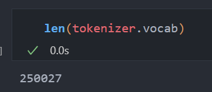
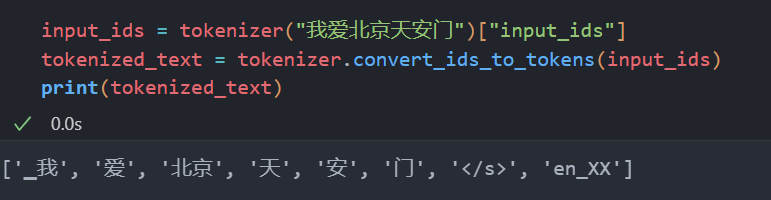
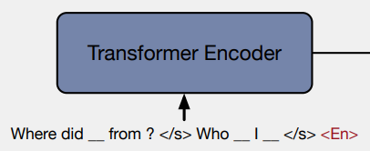
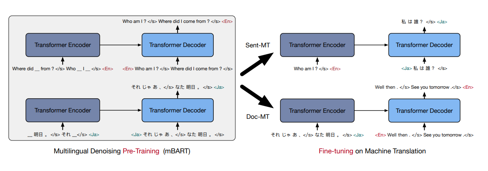
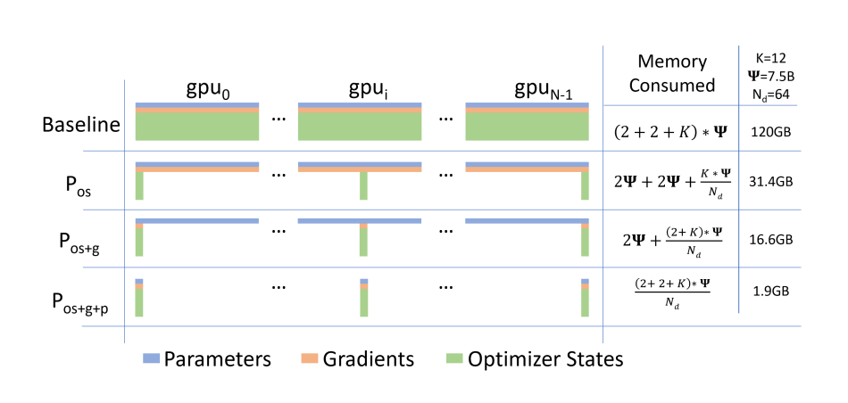
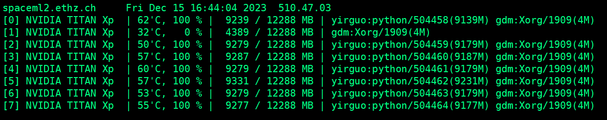
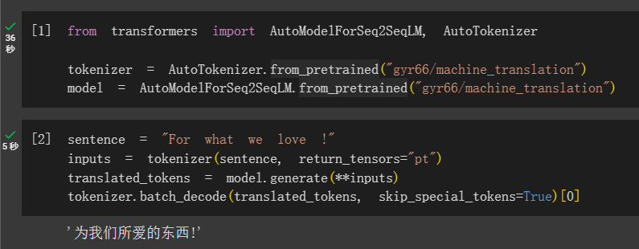
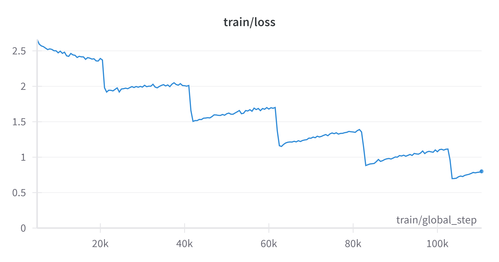

# 机器翻译

我使用[mBART](https://arxiv.org/abs/2001.08210)模型在附件提供的IWSLT14 En-Zh数据集上进行训练。

## 分词策略

使用mBART的tokenizer，采用的分词方式是**BPE**。训练分词器时，每次从corpus中选取出现频率最高的一个pair，merge之后放入词典中，同时更新corpus。重复这个步骤，直到词典大小达到预期的大小。我直接加载使用[mBART-large-cc25](https://huggingface.co/facebook/mbart-large-cc25)预训练时使用的分词器。


词典大小为：250027



Tokenize “我爱北京天安门”，结果如下（与mBART预训练保持一致，在输入句子最后添加\</s\>和语言标识en-XX。）：





## 模型架构

我使用mBART模型，mBART是一个标准的[Transformer](https://arxiv.org/abs/1706.03762)模型，使用了12层encoder和12层decoder，hidden_size是1024，16个注意力头。总参数数量约为680M。

mBART专门为机器翻译任务设计，使用了BART的训练目标，在输入序列中加入噪声，进行编码，再解码，还原出原始输入序列。与BART仅在英语语料进行预训练不同，mBART在不同语言的语料上（总共25中语言）进行了预训练（不同语言交替训练，每次随机抽取一个LID）。

论文中提到，对于低资源（少于100万样本）的语言对，**使用mBART比随机初始化的Transformer能够有较大的提升（particularly large gains on low resource language pairs）。附件中给的的样本有14万左右，属于低资源的情景，因此我选用了mBART而不是随机初始化的Transformer。**



## 解码策略

采用**Beam Search**进行解码，num_beams设置为5。

## 模型训练

我借鉴了[run.translation.py](https://github.com/huggingface/transformers/blob/main/examples/pytorch/translation/run_translation.py)，使用huggingface的trainer进行训练，进行了细微修改，作为模型训练脚本（训练脚本请见附件）。

然而，在执行训练时，我发现**即使把per_device_train_batch_size设置为1，显存也不够**（我手里有8张NVIDIA TITAN Xp，2017年的显卡，显存为12G）。trainer使用的数据并行（DP），即使有多张卡，每张卡上都会有一个模型。如果模型无法装入一张卡的显存中，就无法进行训练。

为了能够发挥多卡的优势，我需要将模型进行切分，放到不同的卡上，也就是**模型并行（MP）**。为此，我阅读了[ZeRO](https://arxiv.org/abs/1910.02054)这篇论文。这篇文章致力于训练大模型时的内存优化。提出了各种优化技术，包括：$p_{os}, p_{g}, p_{p}, p_a, C_B, M_D$，使用Stage3优化能够将模型显存占用从$16*model\_size$优化到$\frac{16*model\_size}{N_d}$（$N_d$是显卡的数量）。通过将activations进行切分，使用固定大小的buffer size，解决内存碎片等优化，可以进一步减轻显存压力。核心思想就是将优化器状态、梯度、参数进行划分，放到不同的显卡上，在计算时需要别的显卡上的数据时，通过通信进行获取。



我借助DeepSpeed工具（实现了ZeRO论文中的各种优化技术），最终实现了使用7张NVIDIA TITAN Xp对模型进行训练，训练时间接近80小时（10个Epoch，batch_size=7）（可以使用FP16进行训练，一开始提交训练脚本时忘记了，使用F16进行训练应该可以大大缩短训练时间）。




deepspeed配置文件和训练命令如下：

```json
{
  "bf16": {
    "enabled": "auto"
  },
  "optimizer": {
    "type": "AdamW",
    "params": {
      "lr": "auto",
      "betas": "auto",
      "eps": "auto",
      "weight_decay": "auto"
    }
  },
  "scheduler": {
    "type": "WarmupLR",
    "params": {
      "warmup_min_lr": "auto",
      "warmup_max_lr": "auto",
      "warmup_num_steps": "auto"
    }
  },
  "zero_optimization": {
    "stage": 3,
    "overlap_comm": true,
    "contiguous_gradients": true,
    "sub_group_size": 1e9,
    "reduce_bucket_size": "auto",
    "stage3_prefetch_bucket_size": "auto",
    "stage3_param_persistence_threshold": "auto",
    "stage3_max_live_parameters": 1e9,
    "stage3_max_reuse_distance": 1e9,
    "stage3_gather_16bit_weights_on_model_save": false
  },
  "gradient_accumulation_steps": "auto",
  "gradient_clipping": "auto",
  "steps_per_print": 2000,
  "train_batch_size": "auto",
  "train_micro_batch_size_per_gpu": "auto",
  "wall_clock_breakdown": false
}
```

```sh
deepspeed --include localhost:0,2,3,4,5,6,7 run_translation.py --train_file ./data/train.json \
 --validation_file ./data/valid.json \
 --test_file ./data/test.json \
 --source_lang en_XX --target_lang zh_CN \
 --model_name_or_path facebook/mbart-large-cc25 \
 --output_dir /mnt/ds3lab-scratch/yirguo/models \
 --max_source_length 128 \
 --num_beams 5 \
 --per_device_train_batch_size 1 \
 --per_device_eval_batch_size 1 \
 --num_train_epochs 10 \
 --do_train --do_eval --do_predict \
 --deepspeed ds_config.json
```

训练好的模型上传到了：https://huggingface.co/gyr66/machine_translation

## 评价指标(sacrebleu)

训练9个Epoch后（因为机器原因，只训练了9个Epoch），各个统计指标如下：

训练集损失为：0.5374

验证集损失和BLEU分数为：

- eval_loss: 3.8405
- eval_bleu: 3.5173

测试集损失和BLEU分数为：

- test_loss: 3.8337
- test_bleu: 3.277

可以看到模型overfitting非常严重，可能是因为模型太大和数据集比较小导致。

## 效果测试



## 问题

在模型训练时，我观察到loss下降曲线很奇怪，成阶梯型，在每个Epoch的结尾loss会骤降，如下图所示：



经过搜索，我找到了一个[解释](https://github.com/huggingface/transformers/issues/18730#issuecomment-1229769519)：一个epoch内，一个batch的数据训练并不能提升下一个batch的预测，因此loss保持水平。模型会记住一个batch正确的预测，在下一个epoch，当模型看到相同的batch时，它会产生一个更好的预测。对于一个batch预测水平的好坏取决于模型看到了这个batch多少次，在每个Epoch结束时，所有batch被看到的次数都会加一，因此在下一个epoch，各个batch的loss都会显著低于上一个epoch的loss，从而loss曲线呈现阶梯状。