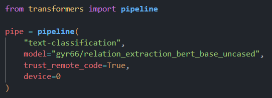

# 作业五：关系抽取

我实现论文[Matching the Blanks: Distributional Similarity for Relation Learning](https://aclanthology.org/P19-1279.pdf)中的结构，在测试集上取得F1值**87.8**。**训练好的模型上传到了huggingface上**：https://huggingface.co/gyr66/relation_extraction_bert_base_uncased。

## 模型结构选择

基于BERT模型，论文中提出了使用BERT进行关系抽取的六种实现方式：


论文中提到：

“For all four tasks, the model using the ENTITY MARKERS input representation and ENTITY START output representation achieves the best scores.”

因此我实现(f)方式：即取出两个实体开始标记的hidden_state，拼接起来作为relation representation。

得到relation representation后，论文使用如下方式将representation应用到关系抽取任务中：


即将relation representation通过一个线性层或者Layer Norm，然后再接一个分类头。论文中提到使用线性层还是Layer Norm是一个超参数选择。论文中给出了如下超参数：

Post Transformer Layer: Dense with linear activation (KBP-37 and TACRED), or Layer Normalization layer (SemEval 2010 and FewRel).

因此，我选用Layer Norm。

论文中提出了Matching the Blanks这种预训练方法，借助entity linking获取大量训练数据，训练一个relation statement的encoder。使用预训练的权重在下游任务中进行微调，可以取得非常好的效果（尤其在下游任务数据量少的情况下）。我观察到在SemEval 2010 Task8这个数据集上，$BERT_{EM}$和$BERT_{EM}+MTB$效果相差很小，因此我选择使用$BERT_{EM}$进行训练。


## 模型结构实现

我使用huggingface的一些工具进行模型实现：transformers加载预训练模型和tokenizer，datasets加载数据集，evaluate计算macro-F1 score，trainer进行模型训练。

1. 首先需要向tokenizer中添加用于分隔两个实体的特殊标记，并把特殊标记id写入模型配置中：

   

   由于改变了词表大小，需要相应调整embedding层的大小（resize_token_embeddings）。

2. 需要在BERT模型的基础上添加Layer Norm层和分类头，**创建一个BertForRelationExtraction类继承BertPreTrainedModel**，添加layer_norm层和classifier层，同时加载BERT的预训练权重：

   

3. 重写forward方法，由于使用trainer进行训练，forward的返回值要兼容trainer的训练流程，需要**返回SequenceClassifierOutput类型**的结果：

   ```python
   def forward(
           self,
           input_ids=None,
           attention_mask=None,
           token_type_ids=None,
           position_ids=None,
           head_mask=None,
           inputs_embeds=None,
           labels=None,
           output_attentions=None,
           output_hidden_states=None,
           return_dict=None,
       ):
           return_dict = (
               return_dict if return_dict is not None else self.config.use_return_dict
           )
   
           outputs = self.bert(
               input_ids,
               attention_mask=attention_mask,
               token_type_ids=token_type_ids,
               position_ids=position_ids,
               head_mask=head_mask,
               inputs_embeds=inputs_embeds,
               output_attentions=output_attentions,
               output_hidden_states=output_hidden_states,
               return_dict=return_dict,
           )
   
           sequence_output = outputs[0]
   
           sequence_output = self.dropout(sequence_output)
   
           e1_start = torch.where(input_ids == self.config.e1_start_token_id)
           e2_start = torch.where(input_ids == self.config.e2_start_token_id)
           
   
           e1_hidden_states = sequence_output[e1_start[0], e1_start[1]]
           e2_hidden_states = sequence_output[e2_start[0], e2_start[1]]
   
           h = torch.cat((e1_hidden_states, e2_hidden_states), dim=-1)
           logits = self.classifier(self.layer_norm(h))
   
           loss = None
           if labels is not None:
               loss_fct = nn.CrossEntropyLoss()
               loss = loss_fct(logits.view(-1, self.num_labels), labels.view(-1))
   
           if not return_dict:
               output = (logits,) + outputs[2:]  # Need to check outputs shape
               return ((loss,) + output) if loss is not None else output
   
           return SequenceClassifierOutput(
               loss=loss,
               logits=logits,
               hidden_states=outputs.hidden_states,
               attentions=outputs.attentions,
           )
   ```

   整体流程：使用BERT获取到最后一层的hidden_state，通过模型配置中的e1_start_token_id和e2_start_token_id获取到两个实体开始标记的位置并拿到对应的hidden_state，将两个hidden_state拼接起来过layer norm和分类头，最后计算交叉熵损失。

4. 整个训练框架，我使用huggingface提供的text-classification的example（[run_classification.py](https://github.com/huggingface/transformers/blob/main/examples/pytorch/text-classification/run_classification.py)），并在此基础上进行了一些修改。这个脚本功能很全面，能够做回归、单标签分类、多标签分类。实现了数据集处理，模型训练、验证、预测、保存和恢复，推送模型到仓库等各个功能，同时能够方便地替换基座模型（比如BERT换成RoBERTa）。使用trainer进行训练，方便多卡数据并行。为了使用自定义的模型，需要将AutoModelForSequenceClassification.from_pretrained()改为BertForRelationExtraction.from_pretrained()：

   

## 模型训练

训练命令如下：

```sh
python run_classification.py  --model_name_or_path bert-base-uncased \
 --dataset_name sem_eval_2010_task_8 \
 --label_column_name relation \
 --output_dir ./output/relation_extraction_bert_base_uncased \
 --num_train_epochs 10 \
 --per_device_train_batch_size 64 \
 --per_device_eval_batch_size 64 \
 --metric_name f1 \
 --logging_strategy epoch \
 --save_strategy epoch \
 --evaluation_strategy epoch \
 --load_best_model_at_end \
 --metric_for_best_model f1 \
 --do_train --do_eval --do_predict \
 --push_to_hub
```

训练10个Epoch，每个Epoch进行一次验证，最终选用验证集（数据集中没有提供验证集，我从训练集中随机切了0.15的数据做验证集）上F1值最大的模型。

## 评价指标

训练过程中要计算验证集上的损失和F1值从而选择验证集上表现最好的模型，使用huggingface的evaluate库可以很方便地计算：


10个Epoch的训练记录如下：


模型训练完成之后，使用官方提供的perl评测脚本在测试集上进行评测，将模型预测输出的predict文件进行一些处理，同时从TEST_FILE_FULL.TXT中提取label，执行作业附件中提供的python脚本，得到测试集上的F1分数为**87.8**：


## 效果测试

为了方便使用自定义的模型，将model.py也上传到huggingface仓库中，并注册到AutoModelForSequenceClassification：


可以借助huggingface提供的pipeline使用模型，非常方便：



下面是两个测试用例：


## 模型仓库

训练好的模型仓库地址：https://huggingface.co/gyr66/relation_extraction_bert_base_uncased


## 问题

我也尝试了使用RoBERTa替换BERT，但是10个Epoch后，验证集上的F1值只有0.4292，和BERT相差很大，感觉可能是超参数设置的原因？使用RoBERTa的模型我也上传到了huggingface模型仓库中：https://huggingface.co/gyr66/relation_extraction_roberta_base。

