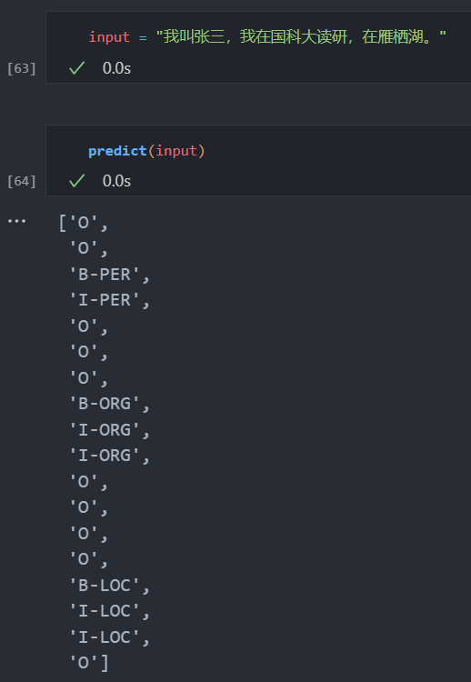

# 作业三：序列标注

## 模型结构

使用**2层双向LSTM**，**最后再加一个CRF层**。Embedding层加载[预训练词向量](https://github.com/Embedding/Chinese-Word-Vectors)（当根据数据集构建的词表中某个词在预训练词向量中时，使用预训练的词向量，否则随机初始化）。CRF层借助[pytorch-crf](https://github.com/kmkurn/pytorch-crf)实现。在foward的时候，使用decode方法将概率最大的序列解码出来，同时如果传递了labels（证明是在训练阶段），则计算损失，将解码的序列和损失一并返回。由于序列做了填充，在解码时和编码时需要需要传递一个mask给crf，指明哪些是实际的序列。mask通过valid_lens生成，小于valid_lens的部分置True，大于valid_lens的部分置False（mask = (torch.arange(seq_len)[None, :].to(valid_lens.device) < valid_lens[:, None])）。

模型定义如下：

```python
class NERModel(nn.Module):
    def __init__(
        self, vocab_size, tag_size, embedding_dim, hidden_dim, num_layers, dropout=0.1
    ):
        self.vocab_size = vocab_size
        self.tag_size = tag_size
        self.embedding_dim = embedding_dim
        self.hidden_dim = hidden_dim
        self.num_layers = num_layers
        self.dropout = dropout

        super().__init__()
        self.embedding = nn.Embedding(vocab_size, embedding_dim)
        self.lstm = nn.LSTM(
            embedding_dim,
            hidden_dim // 2,
            num_layers=num_layers,
            dropout=dropout,
            batch_first=True,
            bidirectional=True,
        )
        self.dropout = nn.Dropout(dropout)
        self.classifier = nn.Linear(hidden_dim, tag_size)
        self.crf = CRF(tag_size, batch_first=True)

    def load_pretrained_embedding(self, vocab, pretrained_embedding):
        for idx, word in enumerate(vocab.get_itos()):
            if word in pretrained_embedding:
                self.embedding.weight.data[idx] = torch.from_numpy(
                    pretrained_embedding[word]
                )

    def forward(self, input_ids, valid_lens, labels=None):
        embeddings = self.embedding(input_ids)
        outputs, _ = self.lstm(embeddings)
        outputs = self.dropout(outputs)
        logits = self.classifier(outputs)
        seq_len = input_ids.size(1)
        mask = (
            torch.arange(seq_len)[None, :].to(valid_lens.device) < valid_lens[:, None]
        )
        tag_ids = self.crf.decode(logits, mask=mask)
        loss = None
        if labels is not None:
            loss = -self.crf(logits, labels, mask=mask, reduction="mean")
        return tag_ids, loss
```

## 数据集处理

自定义NERDataset数据集，处理过程如下：

1. 从磁盘中读取corpus和label；
2. 如果是训练集（vocab=None），使用corpus构建词表（借助torchtext.vocab.build_vocab_from_iterator实现）；
3. 定义tag2id；
4. 将corpus和label通过vocab和tag2id转换为id；
5. 将不同长度的序列进行填充截断到固定长度，记录序列的实际长度（valid_lens），用于在计算损失和解码时生成mask。

在读取时，将input_ids、labels和valid_lens返回。

```python
class NERDataset(Dataset):
    def __init__(self, corpus_file_path, label_file_path, max_length, vocab=None):
        with open(corpus_file_path, "r", encoding="utf-8") as f:
            corpus = f.readlines()
        with open(label_file_path, "r", encoding="utf-8") as f:
            label = f.readlines()
        corpus = [line.strip().split() for line in corpus]
        label = [line.strip().split() for line in label]
        assert len(corpus) == len(label), "corpus and label must have same length"

        if vocab is None:
            self.vocab = build_vocab_from_iterator(
                corpus, specials=["<unk>", "<pad>"], special_first=True
            )
        else:
            self.vocab = vocab
        self.vocab.set_default_index(self.vocab["<unk>"])

        self.tag2id = {
            "O": 0,
            "B-PER": 1,
            "I-PER": 2,
            "B-ORG": 3,
            "I-ORG": 4,
            "B-LOC": 5,
            "I-LOC": 6,
            "PAD": 7,
        }

        self.corpus = []
        self.label = []
        self.valid_len = []
        for corpus_line, label_line in zip(corpus, label):
            assert len(corpus_line) == len(
                label_line
            ), "corpus and label must have same length"
            self.valid_len.append(len(corpus_line))
            self.corpus.append(self.vocab(corpus_line))
            self.label.append([self.tag2id[tag] for tag in label_line])
            if len(self.corpus[-1]) > max_length:
                self.corpus[-1] = self.corpus[-1][:max_length]
                self.label[-1] = self.label[-1][:max_length]
                self.valid_len[-1] = max_length
            else:
                self.corpus[-1] = self.corpus[-1] + [self.vocab.get_stoi()["<pad>"]] * (
                    max_length - len(self.corpus[-1])
                )
                self.label[-1] = self.label[-1] + [self.tag2id["PAD"]] * (
                    max_length - len(self.label[-1])
                )

        self.corpus = torch.Tensor(self.corpus).long()
        self.label = torch.Tensor(self.label).long()
        self.valid_len = torch.Tensor(self.valid_len).long()

    def __getitem__(self, item):
        return self.corpus[item], self.label[item], self.valid_len[item]

    def __len__(self):
        return len(self.label)
```

## 超参数设置

超参数设置如下：

```python
class Config:
    def __init__(self):
        self.max_length = 128

        self.embedding_dim = 300
        self.hidden_dim = 512
        self.num_layers = 2
        self.dropout = 0.1

        self.learning_rate = 1e-3
        self.batch_size = 512
```

## 模型训练

由于模型在forward时将tag_ids和loss进行了返回，因此可以直接使用loss.backward()计算梯度。

```python
def train_epoch(model, dataloader, optimizer):
    model.train()
    total_loss = 0.0
    for input_ids, labels, valid_lens in dataloader:
        optimizer.zero_grad()
        input_ids, labels, valid_lens = (
            input_ids.to(DEVICE),
            labels.to(DEVICE),
            valid_lens.to(DEVICE),
        )
        _, loss = model(input_ids, valid_lens, labels)
        loss.backward()
        optimizer.step()
        total_loss += loss.item() * input_ids.size(0)
    return total_loss / len(dataloader.dataset)
```

## 模型验证

由于数据集各个类别不平衡，O数量远大于其它类别数量。使用准确率、召回率和F1作为评测指标。借助sklearn.metrics实现准确率、召回率和F1的计算（tag_ids为实际的预测标签序列，labels需要根据valid_lens还原回没填充之前，将不同批次的tag_ids和labels压平后收集到一起，最后计算precision、recall和f1）。

```python
def validate_epoch(model, dataloader):
    def flat_list(nested_list):
        return [e for inner_list in nested_list for e in inner_list]
    preds = []
    true_labels = []
    model.eval()
    for input_ids, labels, valid_lens in dataloader:
        input_ids, labels, valid_lens = (
            input_ids.to(DEVICE),
            labels.to(DEVICE),
            valid_lens.to(DEVICE),
        )
        with torch.no_grad():
            tag_ids, _ = model(input_ids, valid_lens)
        labels = [
            label[:valid_len]
            for label, valid_len in zip(labels.tolist(), valid_lens.tolist())
        ]
        preds.extend(flat_list(tag_ids))
        true_labels.extend(flat_list(labels))
    precision = precision_score(true_labels, preds, average="macro")
    recall = recall_score(true_labels, preds, average="macro")
    f1 = f1_score(true_labels, preds, average="macro")
    return precision, recall, f1
```

## 模型推理

从磁盘上将保存的模型和词表加载到内存中。使用模型时，将文本通过词表转换为input_ids，模型输出得到tag_ids，通过id2tag转换为最终的标签序列。

```python
import torch
import pickle

DEVICE = torch.device("cuda:6" if torch.cuda.is_available() else "cpu")

model = torch.load("NERModel.pth").to(DEVICE)

with open("vocab.pkl", "rb") as f:
    vocab = pickle.load(f)
word2idx = vocab.get_stoi()

tag2id = {
    "O": 0,
    "B-PER": 1,
    "I-PER": 2,
    "B-ORG": 3,
    "I-ORG": 4,
    "B-LOC": 5,
    "I-LOC": 6,
    "PAD": 7,
}
id2tag = {v: k for k, v in tag2id.items()}

def predict(text):
    model.eval()
    with torch.no_grad():
        input_ids = (
            torch.tensor([word2idx[word] for word in text], dtype=torch.long)
            .unsqueeze(0)
            .to(DEVICE)
        )
        valid_lens = torch.tensor([input_ids.size(1)], dtype=torch.long).to(DEVICE)
        tag_ids, _ = model(input_ids, valid_lens)
        tags = [id2tag[tag_id] for tag_id in tag_ids[0]]
        return tags
```



## 测评结果

分多次训练，每次训练从上一个最好的检查点继续训练，最后10个epoch的训练记录如下：

```shell
(ADMM) yirguo@spaceml2:~/projects/NLP_homework/sequence_tagging$ python train.py --epoch 10         
Epoch: 1 | Loss: 0.05014443362988506                                                                
Precision: 0.9157238763639848 | Recall: 0.8896381023655566 | F1: 0.9022551853759307                 
Epoch: 2 | Loss: 0.08754206321513762                                                                
Precision: 0.9235201327521205 | Recall: 0.8835783417633569 | F1: 0.9027416618434615                 
Epoch: 3 | Loss: 0.05889212952497219                                                                
Precision: 0.9315492376740886 | Recall: 0.8928743220207238 | F1: 0.9115680311431381                 
Epoch: 4 | Loss: 0.04903632151000821                                                                
Precision: 0.9307280785327529 | Recall: 0.8857043315358066 | F1: 0.9073930333881775                 
Epoch: 5 | Loss: 0.03926540111443843                             
Precision: 0.9252523675741379 | Recall: 0.8895505731363368 | F1: 0.9065218261948406                 
Epoch: 6 | Loss: 0.03889355790214917                                                                
Precision: 0.9293519981434404 | Recall: 0.8960022458651713 | F1: 0.9121680725960284
Epoch: 7 | Loss: 0.05213511761887839
Precision: 0.9284181678317739 | Recall: 0.8964055181888204 | F1: 0.9118297151247662
Epoch: 8 | Loss: 0.03706103943897515
Precision: 0.9193013326842883 | Recall: 0.9089895870559769 | F1: 0.9139597190803964
Epoch: 9 | Loss: 0.0342960968741066
Precision: 0.9244590142896089 | Recall: 0.8984384986726847 | F1: 0.9110255856669264
Epoch: 10 | Loss: 0.029801226662069417
Precision: 0.919425113408337 | Recall: 0.9050150900602111 | F1: 0.9120470564786464
(ADMM) yirguo@spaceml2:~/projects/NLP_homework/sequence_tagging$ python train.py --dry_run
Precision: 0.9193013326842883 | Recall: 0.9089895870559769 | F1: 0.9139597190803964
```

可以看到模型**在验证集上的最好的F1值约为0.914**。