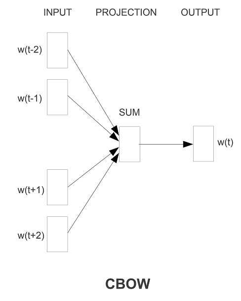
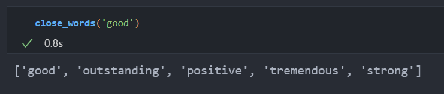
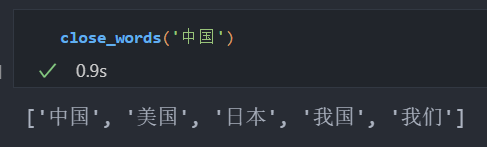

# 作业二：词向量训练

本次作业我使用的词向量模型是**CBOW**（**Continuous Bag of Words**）。

## 模型结构

**使用上下文词预测目标词**：将目标词相邻的上下文词向量相加，取平均，送入一个映射层(embedding_dim * vocab_size)，得到目标词的概率分布，与目标词做交叉熵损失。



代码如下：

```python
class CBOW(nn.Module):
    def __init__(self, vocab_size, embedding_dim):
        super(CBOW, self).__init__()
        self.embedding = nn.Embedding(vocab_size, embedding_dim)
        self.linear = nn.Linear(embedding_dim, vocab_size)

    def forward(self, inputs):
        embeds = torch.mean(self.embedding(inputs), dim=1)
        return self.linear(embeds)
```

设window_size是目标词两边上下文词的数量（左边有window_size个词，右边有window_size个词），inputs的shape是[batch_size, window_size * 2]，经过词向量层后shape变为[batch_size, window_size * 2, embedding_dim]，通过沿着dim=1求和取平均，shape变为[batch_size, embedding_dim]，送入线性映射层，shape变为[batch_size, vocab_size]，即得到了目标词的概率分布（未使用softmax做规范化）。

## 训练方式

### 构建数据集

代码如下：

```python
class Corpus(Dataset):
    def __init__(self, data_file_path, window_size=2, tokenizer=None):
        self.window_size = window_size
        self.context_target = []
        with open(data_file_path, "r", encoding="utf-8") as f:
            lines = f.readlines()
        if tokenizer:
            lines = [tokenizer(line.strip()) for line in lines]
        else:
            lines = [line.strip().split(" ") for line in lines]
        self.vocab = build_vocab_from_iterator(lines)
        self.word_to_idx = self.vocab.get_stoi()
        self.idx_to_word = self.vocab.get_itos()
        for line in lines:
            self.context_target.extend(
                [
                    (
                        [line[i - (j + 1)] for j in range(window_size)]
                        + [line[i + (j + 1)] for j in range(window_size)],
                        line[i],
                    )
                    for i in range(window_size, len(line) - window_size)
                ]
            )

    def __getitem__(self, idx):
        context = torch.tensor(self.vocab(self.context_target[idx][0]), dtype=torch.long)
        target = torch.tensor(self.vocab[self.context_target[idx][1]], dtype=torch.long)
        return context, target

    def __len__(self):
        return len(self.context_target)
```

Corpus类继承torch.utils.data.Dataset，接受data_file_path（预料路径）、window_size（窗口大小）、tokenzier（分词器）参数。从语料文件中读取语料构建数据集。

首先进行分词，如果是中文语料，已经分好词，只需要按空格分隔即可，此时分词器可传空。如果是英文语料，传入torchtext.data.get_tokenizer("basic_english")分词器进行分词。

然后构建词汇表，我使用了torchtext.vocab.build_vocab_from_iterator从分好词的句子列表构建词汇表，可以拿到word_to_idx，用于获取某个词的索引，以及idx_to_word，获取某个索引对应的词。

最后构建用于CBOW模型的输入，枚举每个目标词，从左边依次读取window_size个词，右边依次读取window_size个词，作为context_words，和目标词一起形成一个tuple。

在\_\_getitem\_\_方法中，从tuple中提取出context_words(context_target\[idx\]\[0\])和target(context_target\[idx\]\[1\])，通过词汇表vocab转换为idx，然后转换为torch.tensor返回。

### 实例化模型，构建数据加载器、损失函数、优化器

```python
model = CBOW(len(corpus.vocab), EMBEDDING_DIM).to(DEVICE)
dataloader = DataLoader(corpus, batch_size=BATCH_SIZE, shuffle=True, num_workers=NUM_WORKERS)
optimizer = optim.Adam(model.parameters(), lr=0.01)
criterion = nn.CrossEntropyLoss()
```

### 训练模型

```python
for epoch in range(NUM_EPOCH):
    total_loss = 0
    correct = 0
    total_num = 0
    for context, target in tqdm(dataloader, leave=False):
        batch_size = context.shape[0]
        total_num += batch_size
        optimizer.zero_grad()
        context, target = context.to(DEVICE), target.to(DEVICE)
        pred = model(context)
        correct += (torch.argmax(pred, dim=1) == target).sum().item()
        loss = criterion(pred, target)
        loss.backward()
        optimizer.step()
        total_loss += loss.item() * batch_size
    print(f"Epoch {epoch + 1} Loss: {total_loss / total_num:.4f} Acc: {correct / total_num:.4f}")
```

超参数定义如下：

```python
WINDOWS_SIZE = 2
EMBEDDING_DIM = 30
BATCH_SIZE = 512
NUM_EPOCH = 300
NUM_WORKERS = 12
DEVICE = torch.device("cuda" if torch.cuda.is_available() else "cpu")
```

词向量的维数设置为30维，对于中文语料和英文语料各训练300个Epoch。最终的损失和正确率如下：

中文语料：**Epoch 300 Loss: 1.9809 Acc: 0.5829**

英文语料：**Epoch 300 Loss: 2.1853 Acc: 0.5377**

## 保存词向量

将词向量从model.embedding.weight中提取出来进行保存：

```python
word_embeddings = {word: model.embedding.weight[idx].tolist() for idx, word in enumerate(corpus.idx_to_word)}

with open('en_embeddings.txt', 'w') as f:
    for word, embedding in word_embeddings.items():
        f.write(f'{word}: {embedding}\n')
```

## 词向量应用

获取相似词

```python
def close_words(x, n = 5):
  embedding = model.embedding.to('cpu')
  vectors = torch.stack([embedding(torch.tensor(vocab[s])) for s in vocab.get_itos()], 0)
  vec = embedding(torch.tensor(vocab[x]))
  top5 = np.linalg.norm(vectors.detach().numpy() - vec.detach().numpy(), axis = 1).argsort()[:n]
  return [ vocab.get_itos()[x] for x in top5 ]
```

对于英文语料，查询good的相似词如下：



对于中文语料，查询中国的相似词如下：

